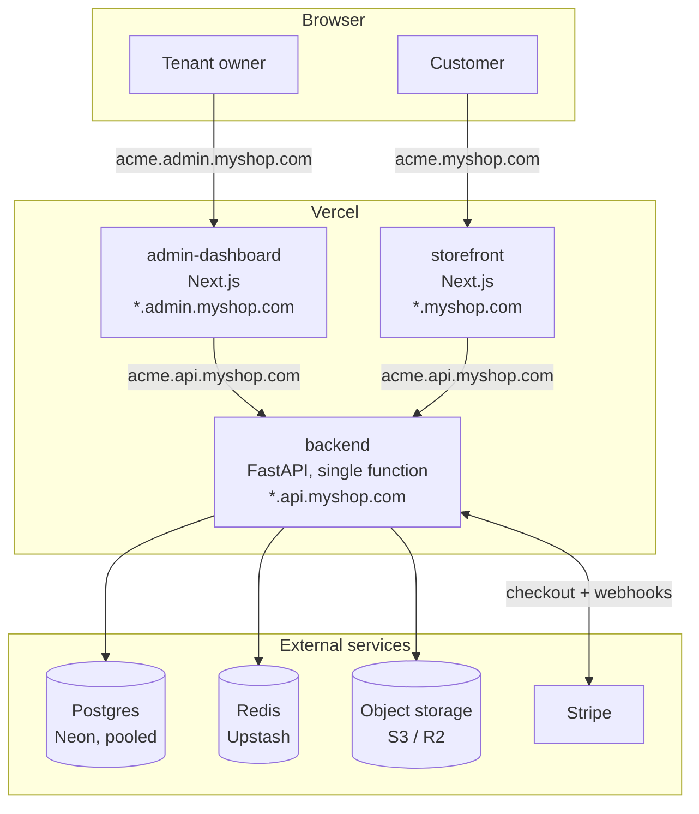
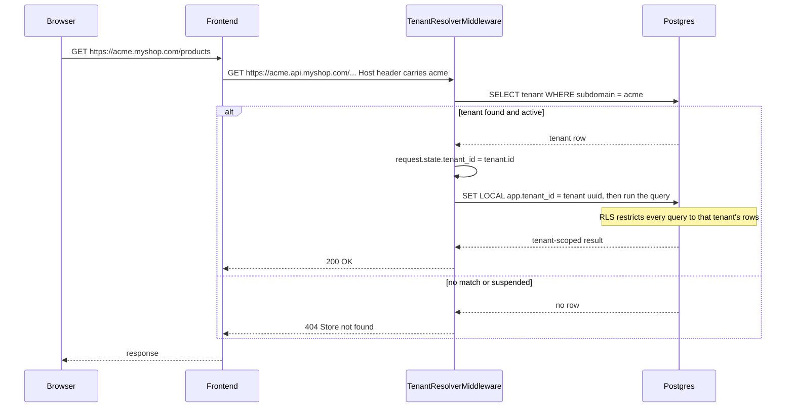

# E_Commerce

A multi-tenant e-commerce SaaS platform: one deployment serves many
independent storefronts, each on its own subdomain, each with its own
catalog, branding, customers, and orders — isolated at the database level
by row-level security, not just application-level filtering.

Every tenant-facing feature in the spec is implemented and working:
tenant onboarding, admin auth, theme/branding customization, a full
product catalog with full-text search, a public storefront API, cart →
checkout → Stripe-backed payment, plan-tier limits, and a real superadmin
console. What's *not* built is the one piece the spec explicitly scoped as
a stretch goal — custom domains (Phase 11) — plus a short list of other
deliberate simplifications documented in
[`docs/decisions/README.md`](docs/decisions/README.md).

## Structure

```
backend/          FastAPI + SQLAlchemy (async) + Alembic — Clean Architecture:
                   domain/ → application/ → infrastructure/ + presentation/
admin-dashboard/   Next.js app tenant owners use to run their store
storefront/        Next.js app end customers shop on (one deployment, every tenant)
shared/            Cross-app TypeScript types (not yet wired as an npm workspace —
                   see docs/decisions/README.md)
docs/ARCHITECTURE.md  Diagrams: deployment topology, request flow, code layout, data model
docs/decisions/    ADRs — what was built, why, and what got fixed along the way
docs/DEPLOYMENT.md Step-by-step guide to a real (small-scale) Vercel deployment
```

## Architecture

Three separately-deployed apps sharing one Postgres/Redis/object-storage
backend, all multi-tenant by subdomain:



See [`docs/ARCHITECTURE.md`](docs/ARCHITECTURE.md) for the rest: how a
request finds its tenant, the backend's Clean Architecture code layout,
the core domain model, and the checkout/payment flow — five diagrams
total, each rendered from source and checked before being committed.

## How multi-tenancy works

Every tenant gets a subdomain (`acme.yourplatform.com`). The backend reads
the `Host` header on every request, resolves it to a tenant, and pins that
tenant to the request via `request.state.tenant_id` — never a global or
thread-local. Every tenant-owned table also has a `tenant_id` column and a
Postgres row-level security policy, so isolation holds even if a query
somewhere forgets to filter explicitly. Platform/superadmin routes and the
Stripe webhook endpoint are the two deliberate exceptions (they aren't
scoped to a single tenant by nature); see
[`phase1-tenants.md`](docs/decisions/phase1-tenants.md) and
[`phase7-payments.md`](docs/decisions/phase7-payments.md) for exactly how
each of those gets a tenant re-attached where it still needs one.



## Tech stack

| | |
|---|---|
| Backend | Python 3.12, FastAPI, SQLAlchemy 2.0 (async) + asyncpg, Alembic, Pydantic v2, Redis, Stripe |
| Frontend | Next.js 15 (App Router), React 19, TypeScript, Vitest + Testing Library, Playwright |
| Database | PostgreSQL 16, row-level security for tenant isolation |
| Auth | JWT (access + refresh), separate token spaces for tenant admins, customers, and platform superadmins |
| Deployment | Vercel (all three apps) + Neon (Postgres) + Upstash (Redis) + S3/R2 (object storage) |

Exact pinned versions and why each one was chosen are in
[`docs/decisions/tech-stack.md`](docs/decisions/tech-stack.md).

## Local development

Requires Docker (Postgres + Redis + MinIO) or your own equivalents running
locally.

```bash
# Everything except the app processes themselves:
docker compose up -d postgres redis minio

# Backend
cd backend
python3.12 -m venv .venv && source .venv/bin/activate
pip install -e ".[dev]"
cp .env.example .env                # defaults match docker-compose as-is
alembic upgrade head                # creates every table + RLS policy + seed data
python scripts/create_platform_admin.py --email you@example.com
python scripts/seed_demo_data.py --subdomain demo --owner-email owner@demo.example
uvicorn src.main:app --reload       # http://localhost:8000

# Admin dashboard (separate terminal)
cd admin-dashboard
cp .env.example .env.local
npm install && npm run dev          # http://localhost:3000

# Storefront (separate terminal)
cd storefront
cp .env.example .env.local
npm install && npm run dev          # http://localhost:3001
```

Or run the whole backend stack (API + Postgres + Redis + MinIO) in
containers:

```bash
docker compose up
```

Browsing a specific tenant locally needs its subdomain in the URL — e.g.
`http://demo.localhost:3001` for the storefront seeded above — since the
backend resolves tenants from the `Host` header on every request,
including in local dev. Plain `localhost` with no subdomain has no tenant
and 404s.

### Bootstrapping the database from scratch

`alembic upgrade head` against an *empty* database is the entire "create
the schema" step — all 11 migrations run in order and leave you with every
table, index, and RLS policy, plus seeded starter themes and subscription
plans. Nothing manual beyond having `DATABASE_URL` point at that empty
database. From there:

- `scripts/create_platform_admin.py` creates a superadmin login for
  `/api/v1/platform/*` (tenant management, usage, plan overrides).
- `scripts/seed_demo_data.py` creates one demo tenant with an owner login,
  two categories, and six published products — enough to exercise the
  storefront, cart, checkout, and admin dashboard immediately.

Both are idempotent-safe to re-run (they skip/error cleanly if the
email/subdomain already exists rather than duplicating data).

## Testing

```bash
cd backend && pytest                # unit always run; integration/e2e need Docker
cd admin-dashboard && npm run test  # Vitest + Testing Library
cd storefront && npm run test       # Vitest + Testing Library
```

Playwright e2e specs exist for both frontends
(`*/tests/e2e/*.spec.ts`, run via `npm run test:e2e`) but need the full
live stack (backend + Postgres + Redis + a running dev server) — they
aren't wired into CI yet, same gap as the backend's Docker-dependent
integration/e2e tiers. See each phase's ADR for what's actually been
verified where.

## Deploying

[`docs/DEPLOYMENT.md`](docs/DEPLOYMENT.md) is a full step-by-step guide to
a real, small-scale-but-fully-featured production deployment on Vercel +
Neon + Upstash + Cloudflare R2/AWS S3 — domain/DNS layout, environment
variables for all three apps, running migrations against a hosted
database, Stripe webhook setup, and a smoke-test checklist.

## Decisions and history

[`docs/decisions/README.md`](docs/decisions/README.md) is the index: one
ADR per phase, plus the cross-cutting patterns (and the bugs) that showed
up repeatedly across them, and an explicit list of what was deliberately
left out of v1 scope and why.
