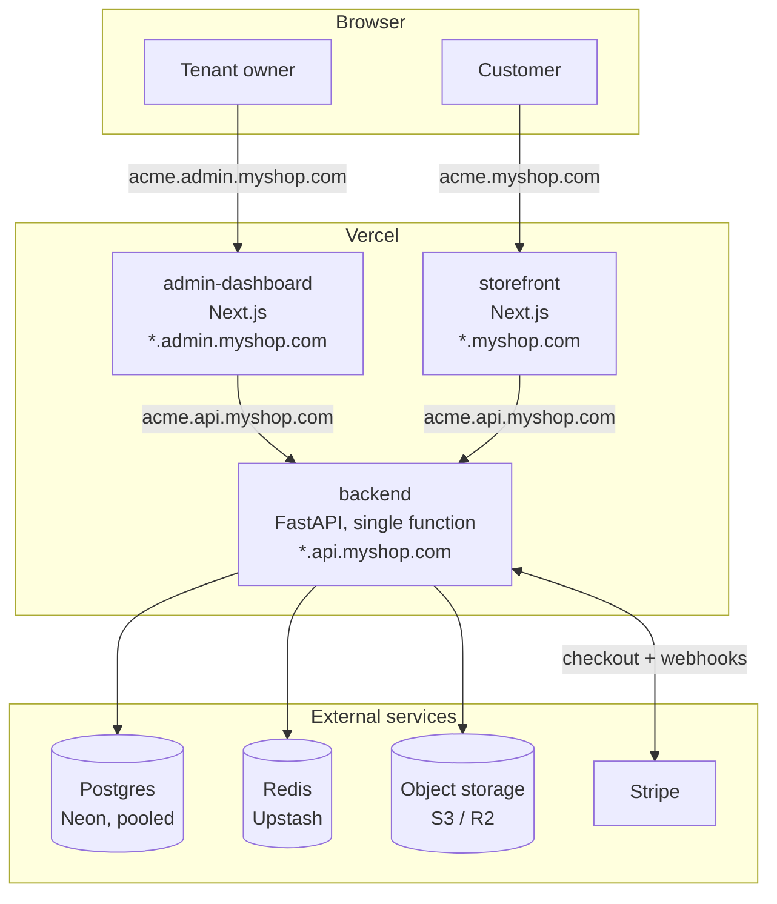
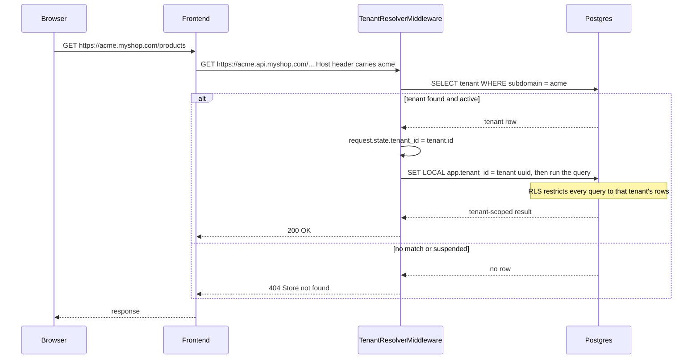
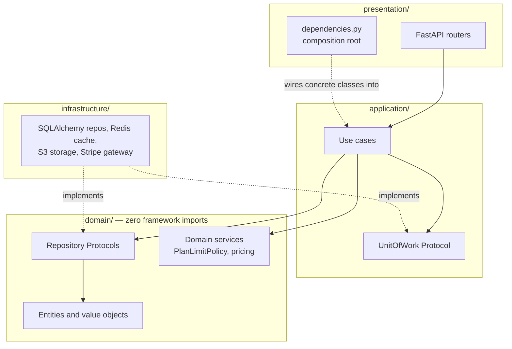
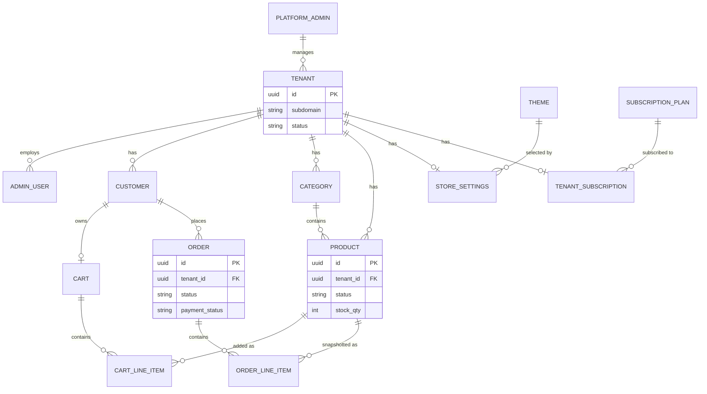
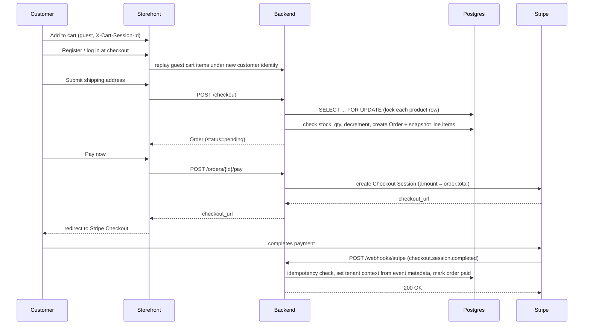

# Architecture

Five diagrams, each answering a different "how does this work" question:
what's deployed where, how a request finds the right tenant, how the
backend code is organized, what the core data model looks like, and how
checkout/payment actually completes. Read [`docs/decisions/README.md`](decisions/README.md)
for *why* each of these ended up the way it did — this page is just the
shape of the system.

## 1. Deployment topology

Three separately-deployed apps sharing one Postgres/Redis/object-storage
backend, all multi-tenant by subdomain. See
[`docs/DEPLOYMENT.md`](DEPLOYMENT.md) for the full setup.

Each tenant's slice of every wildcard domain is the *same label* —
`acme.myshop.com`, `acme.admin.myshop.com`, and `acme.api.myshop.com` are
one tenant's storefront, dashboard, and API origin respectively. The
frontends derive that third URL themselves at request time (see diagram
2) — nothing in the deployed config hardcodes a tenant.

## 2. How a request finds its tenant

There is no tenant fallback anywhere in the backend. A `Host` header that
doesn't resolve to an active tenant is a 404, on every route except the
handful (platform/superadmin, tenant registration, Stripe webhooks) that
are explicitly exempt because they aren't scoped to one tenant by nature.

Two independent layers of isolation, deliberately redundant:

- **Application layer**: every tenant-scoped repository query filters by
  `tenant_id` explicitly.
- **Database layer**: Postgres row-level security policies enforce the
  same filter server-side, keyed off `current_setting('app.tenant_id')`
  — so even a repository method that *forgot* the filter still can't leak
  another tenant's rows. This is what "RLS as defense in depth" (not the
  only mechanism) means in practice.

The `App` step at the top — turning `acme.myshop.com` into a request
*to* `acme.api.myshop.com` — happens client-side (or server-side during
SSR) in each frontend's `resolveApiBaseUrl()`: take the leftmost label of
whatever hostname the frontend is being viewed at, and splice it onto the
configured API host. That's what lets one frontend deployment serve every
tenant.

## 3. Backend code organization (Clean Architecture)

Dependencies point inward only: `domain/` imports nothing from any other
layer (no FastAPI, no SQLAlchemy — it's plain Python + `Protocol`s),
`application/` depends only on `domain/`, and `infrastructure/` depends on
`domain/` to *implement* its repository protocols rather than the other
way around. `presentation/dependencies.py` is the one place that knows
about concrete infrastructure classes at all — it's the composition root
that wires them into use cases via FastAPI's dependency injection.

A use case never imports a `SqlAlchemy*Repository` — it only ever sees
the `Protocol` from `domain/repositories/`, so the exact same use case
runs against a real Postgres-backed repo in production and an in-memory
fake in unit tests, with no test-only branching in application code.

## 4. Core domain model

Every box below `TENANT` (except `THEME` and `SUBSCRIPTION_PLAN`, which
are platform-level catalogs shared by every tenant) carries a `tenant_id`
and an RLS policy.

`ORDER_LINE_ITEM` deliberately *snapshots* `product_name`/`unit_price`
at checkout time rather than joining live to `PRODUCT` — an order has to
stay historically accurate even if the product is later renamed,
repriced, or deleted.

## 5. Checkout and payment

The two things worth noticing: stock is decremented under a real
row-level lock (oversell is structurally impossible, not just unlikely),
and payment completion arrives *asynchronously* via webhook, not in the
checkout request itself.

The webhook step is exempt from `TenantResolverMiddleware` (Stripe posts
to one global URL, not a tenant subdomain), so the tenant context RLS
needs is set explicitly from the event's own metadata rather than from
the request — see [`phase7-payments.md`](decisions/phase7-payments.md).
Idempotency is checked both in the application layer and enforced again
by a database unique constraint, so two near-simultaneous deliveries of
the same webhook event can't double-process even if they race each other
past the first check.
